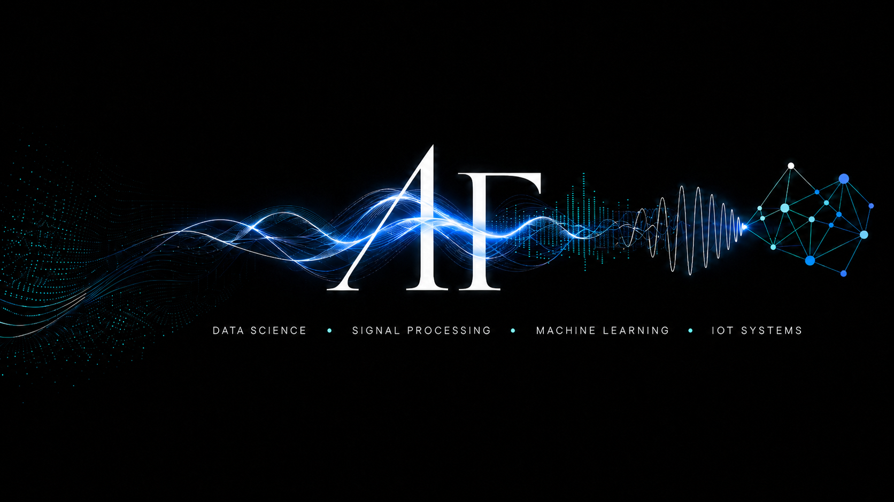

  

## Hi , I'm Anderson Ferreira

## PhD Researcher · Signal Processing & Applied ML · UNICAMP

### Welcome to my Git!

  

---

## 🔬 About Me

PhD candidate in Mechanical Engineering at UNICAMP (Vibroacoustics Laboratory), with applied research in **signal processing**, **sensor systems**, and **machine learning evaluation** for real-world operational data.

- 📄 Paper accepted at *Mechanical Systems and Signal Processing* (MSSP, 2026 · IF 8.9)
- 🏆 AWS Certified AI Practitioner
- 🎓 MSc in Mechanical Engineering — UNICAMP (2013) · BS in Physics — UNICAMP (2010)
- 👨‍🏫 Adjunct Professor — Cruzeiro do Sul Educacional (Feb 2025–present)

Deep expertise in **model validation**, **feature engineering**, and **evaluation design** — including identifying where and why ML approaches fall short in domain-specific problems.

---

## 🌐 Portfolio

> Projects, CV, and research showcase:
> **[anderson-ferreira-83.github.io](https://anderson-ferreira-83.github.io/)**

| Project | Highlights |
|---|---|
| **IoT End-to-End ML Pipeline** | ESP32 · 210k records · 104→16 features · Random Forest 97.34% ± 0.63% CV |
| **Hypertension Risk Prediction** | SMOTE · 4,240 samples · Data leakage prevention · Multi-metric evaluation |
| **MSSP Publication (2026)** | Signal processing · 5 geometries compared · Data-driven approach · IF 8.9 |

---

## 🚀 Main Projects

| IoT End-to-End ML Pipeline | Hypertension Risk Prediction |
|---|---|
| **Signal classification with ESP32 · FastAPI · Oracle XE · Random Forest** | **Imbalanced-class ML evaluation with SMOTE and threshold analysis** |
|  |  |

| PhD Research — ML Applied | MSSP Publication (IF 8.9) |
|---|---|
| **Machine learning applied to thin-plate vibroacoustic modeling** | **Peer-reviewed article · Mechanical Systems and Signal Processing · 2026** |
|  |  |

---

## 💻 Technical Skills

**Domain** · Physics · Signal Processing · Sensor Systems · Statistical Modeling · Data-Driven Analysis

**ML / Stats** · Random Forest · SMOTE · SHAP · Feature Engineering · Cross-validation · Threshold Analysis · AUC-ROC · EDA · Applied Statistics

**Tools** · Python · SQL · Java · scikit-learn · FastAPI · Docker · AWS · Oracle SQL

**Visualization** · Matplotlib · Seaborn · Plotly

---

## ⚙️ GitHub Analytics

---

## 🎸 Fun Fact

🎶 Passionate about music — I play both acoustic and electric guitar!
