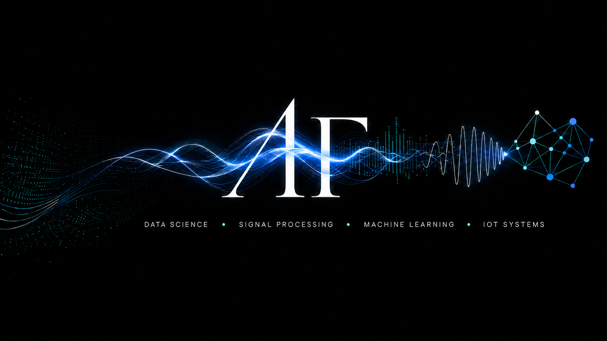

  

<h1 align="center">
  Hi , I'm Anderson Ferreira
</h1>

<h3 align="center">Applied Machine Learning & Data Science · Signal Processing · IoT Systems · AWS</h3>

<strong>Open to industry opportunities in Applied ML, Data Science, ML Engineering, and R&amp;D.</strong>

Welcome to my Git!

  

  
  
  
  
  

---

## 👤 Professional Profile

Applied Machine Learning and Data Science professional with a strong research background, focused on building and evaluating reliable solutions for **signal processing**, **sensor systems**, **IoT**, and real-world operational data.

Currently a PhD candidate in Mechanical Engineering at UNICAMP (Vibroacoustics Laboratory).

- 📄 Paper accepted at *Mechanical Systems and Signal Processing* (MSSP, 2026 · IF 8.9)
- 🏆 AWS Certified AI Practitioner
- 🎓 MSc in Mechanical Engineering — UNICAMP (2013) · BS in Physics — UNICAMP (2010)
- 👨‍🏫 Adjunct Professor — Cruzeiro do Sul Educacional (Feb 2025–present)

Strong expertise in **model validation**, **feature engineering**, and **evaluation design**, with particular attention to data leakage, model reliability, and performance under real-world conditions.

---

## 🎯 Industry Focus

- **End-to-end ML pipelines** · Sensor acquisition · Feature engineering · APIs · Databases · Model evaluation
- **Sensor and IoT data** · ESP32 · Operational signals · Real-world data workflows
- **Reliable ML evaluation** · Data leakage prevention · Cross-validation · Imbalanced-class analysis · Threshold selection
- **Production-oriented tools** · Python · SQL · FastAPI · Oracle SQL · Docker · AWS
- **Decision-ready analysis** · Statistical modeling · Reproducible results · Clear visualization

---

## 🌐 Portfolio

  Projects, CV, and research showcase: 
  <strong><a href="https://anderson-ferreira-83.github.io/">anderson-ferreira-83.github.io</a></strong>

| Project | Highlights |
| :--- | :--- |
| **IoT End-to-End ML Pipeline** | ESP32 · 210k records · 104→16 features · Random Forest 97.34% ± 0.63% CV |
| **Hypertension Risk Prediction** | SMOTE · 4,240 samples · Data leakage prevention · Multi-metric evaluation |
| **MSSP Publication (2026)** | Signal processing · 5 geometries compared · Data-driven approach · IF 8.9 |

---

## 🚀 Main Projects

### 📡 IoT End-to-End ML Pipeline

> End-to-end signal classification pipeline integrating **ESP32**, **FastAPI**, **Oracle XE**, and **Random Forest** across **210k records**.
>
> → **[View repository](https://github.com/anderson-ferreira-83/oracle_fast_api_iot_esp32_MPU6050_project)**

### 🩺 Hypertension Risk Prediction

> Reliable imbalanced-class ML evaluation across **4,240 samples**, with **SMOTE**, data leakage prevention, multi-metric validation, and threshold analysis.
>
> → **[View repository](https://github.com/anderson-ferreira-83/Hyperten_ML)**

### 🤖 PhD Research — ML Applied

> Applied machine learning for thin-plate vibroacoustic modeling, combining physical-domain knowledge with data-driven analysis.
>
> → **[View repository](https://github.com/anderson-ferreira-83/machine_learning_mindlin_stl)**

### 📄 MSSP Publication (IF 8.9)

> Peer-reviewed research published in *Mechanical Systems and Signal Processing* (2026).
>
> → **[View repository](https://github.com/anderson-ferreira-83/Artigo_1_revista_comp_lattices_thin_plate_2023_v_revisao)**

---

## 💻 Technical Skills

**Domain** · Physics · Signal Processing · Sensor Systems · Statistical Modeling · Data-Driven Analysis

**ML / Stats** · Random Forest · SMOTE · SHAP · Feature Engineering · Cross-validation · Threshold Analysis · AUC-ROC · EDA · Applied Statistics

**Tools** · Python · SQL · Java · scikit-learn · FastAPI · Docker · AWS · Oracle SQL

**Visualization** · Matplotlib · Seaborn · Plotly

  
  
  
  
  
  
  

  
  

  
  
  
  
  

---

## ⚙️ GitHub Analytics

  
  

---

## 🎸 Fun Fact

🎶 Passionate about music — I play both acoustic and electric guitar!
